# Rental-House-Price-Prediction
A machine learning project to predict rental apartment prices in Bursa, Turkey. Data was collected by scraping multiple real estate platforms, followed by preprocessing, analysis, and model development using various regression algorithms.

# 🏠 House Rental Price Prediction – Bursa, Turkey

## 📂 Overview

With the surge in housing demand and fluctuating rent prices, making data-driven decisions in the real estate market has become increasingly vital. This project focuses on **predicting rental apartment prices** in **Bursa, Turkey**, using real estate data scraped from major property platforms.

---

## 🎯 Project Goals

- Scrape real estate listings from Turkish property websites
- Clean and preprocess the data
- Conduct exploratory data analysis (EDA)
- Train and evaluate multiple machine learning regression models
- Identify key features that impact rental prices
- Provide a tool to estimate prices based on apartment features

---

## 🛠️ Tools & Technologies

- **Languages**: Python
- **Libraries**: pandas, numpy, matplotlib, seaborn, plotly, scikit-learn
- **Web Scraping**: BeautifulSoup, Selenium
- **ML Algorithms**: Linear Regression, Decision Tree, Random Forest, SVR, Lasso

---

## 📥 Data Collection

The dataset was constructed by scraping listings from:

- 🏡 [HepsiEmlak](https://www.hepsiemlak.com/)
- 🏢 [Emlakjet](https://www.emlakjet.com/)
- 🏘 [Remax](https://www.remax.com.tr/)

### Main Features

- `price_clean`: Monthly rent (TL)
- `m2_net_clean`: Net usable area
- `oda_clean`: Number of rooms
- `banyo_sayisi_clean`: Number of bathrooms
- `kat_sayisi_clean`: Total floors
- `bulundugu_kat_clean`: Apartment’s floor
- `bina_yasi_clean`: Age of the building
- `Isıtma Türü`: Heating type
- `İlçe`: District
- `eşyalı`: Furnished (Yes/No)
- `site içinde`: Inside site (Yes/No)

---

## 🧹 Data Preprocessing

- Outlier detection using **Interquartile Range (IQR)**
- One-hot encoding for categorical data
- Standard scaling for numerical values - Scaled all features using StandardScaler
- Train-test split (70/30 and 80/20 variants)
---

## 📊 Data Exploration & Visualization

### 🔍 1. Rent Price Distribution (Before Cleaning)
Skewed due to extreme outliers.

---

### 📦 2. Boxplot of Raw Rent Prices

Outliers above 50,000 TL distort the distribution.

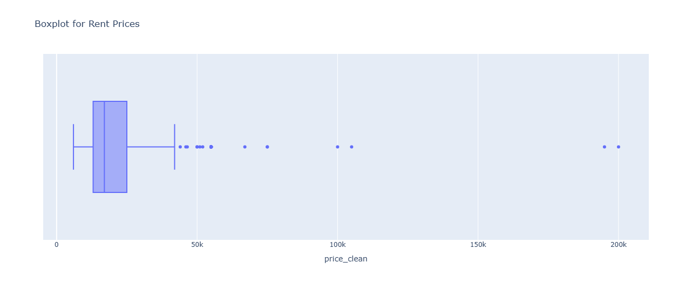

---

### 🧽 3. After Outlier Removal

Boxplot and histogram show a cleaner, more realistic distribution.

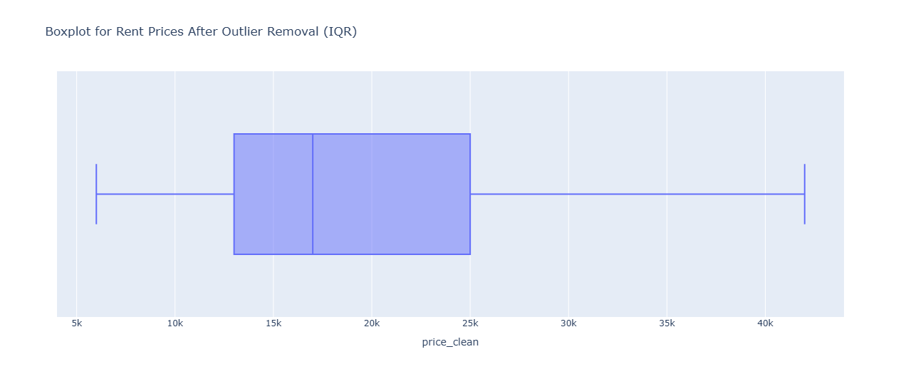 
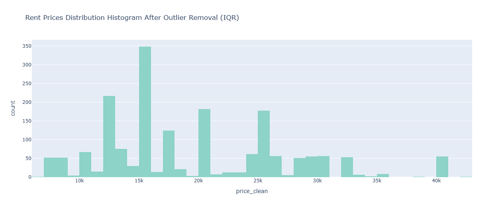

---

### 🛋 4. Room Count vs. Price (Boxenplot)

Price generally increases with more rooms.

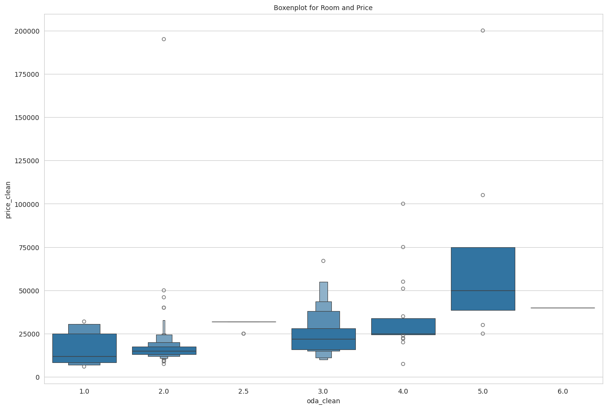

---

### 🔥 5. Feature Correlation

Heatmap of correlation between numerical features.

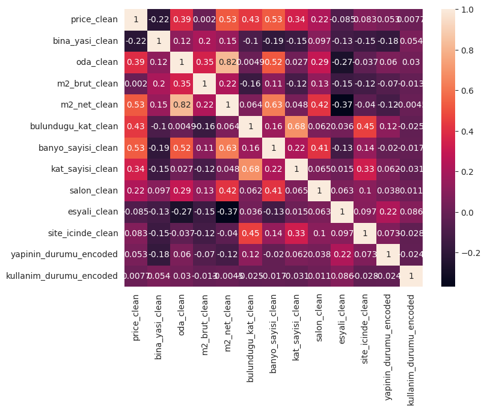

---

### 📊 6. Pairwise Scatter Plots

Relationship across key numerical features.

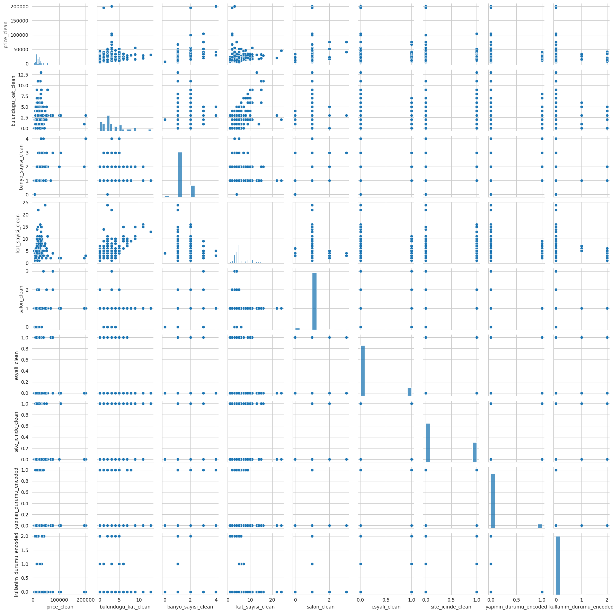

---

### 🚿 7. Bathroom Count Distribution

Most listings have 1 bathroom. Few have more.

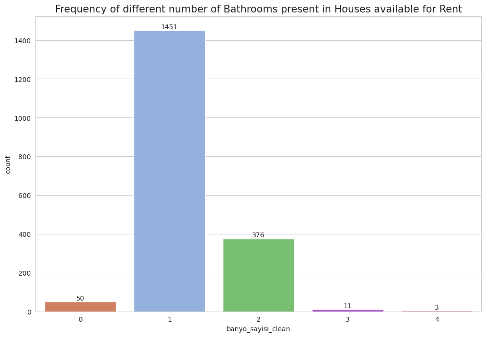

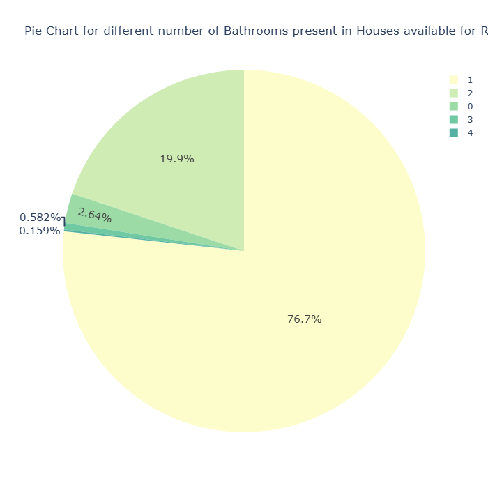

---

### 🏢 8. Floor Number Distribution

Most listings are between 3–6 floors.

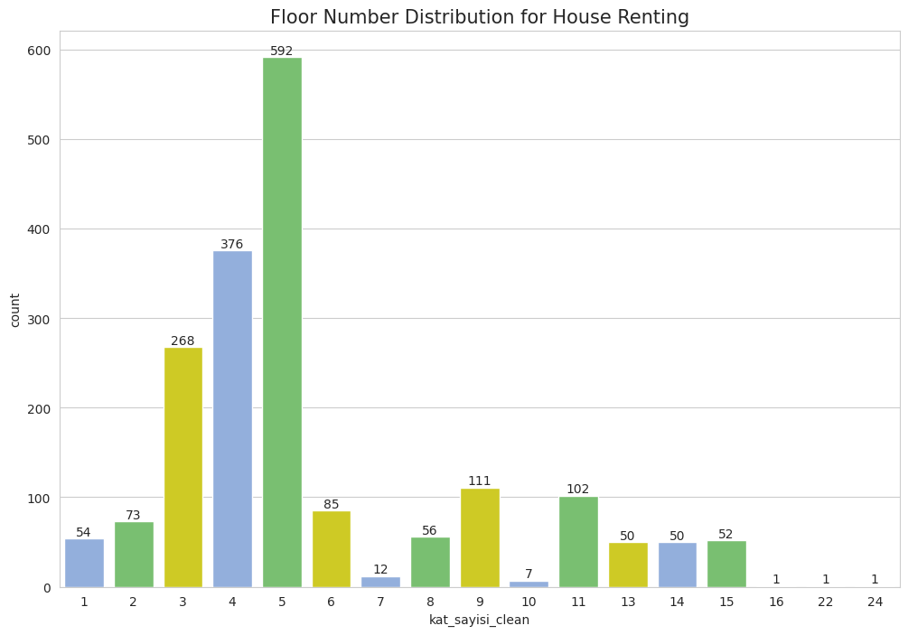 

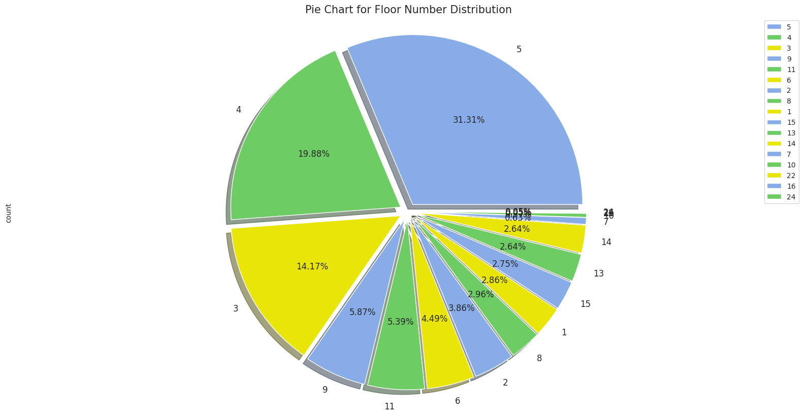

---

## 🤖 Machine Learning Models

We applied the following regression models:

| Model               | Preprocessing | Scaled | Notes                    |
|---------------------|---------------|--------|---------------------------|
| Linear Regression   | Yes           | Yes    | Baseline model            |
| Decision Tree       | Yes           | No     | Handles non-linear data   |
| Random Forest       | Yes           | No     | Best performing model     |
| SVR                 | Yes           | Yes    | Kernel-based approach     |
| Lasso Regression    | Yes           | Yes    | For feature selection     |

---

### 🎯 Actual vs Predicted Prices (Best Model)

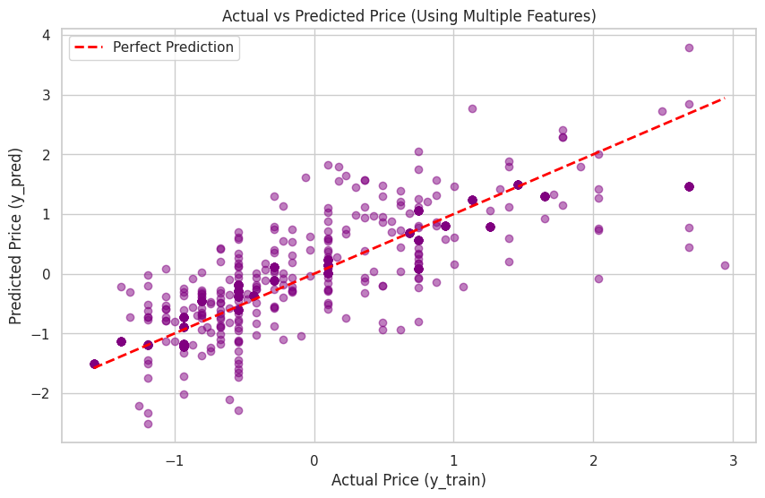

---

### 🌟 Feature Importance (Random Forest)

Net usable area and floor level have the most influence on rental prices.

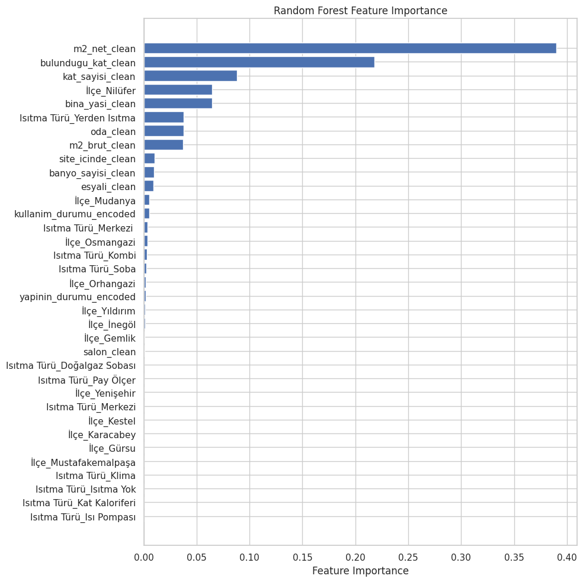

---

### 📉 Model Comparison (MAE / MSE / RMSE)

Random Forest consistently outperformed others.

---

## 📌 Key Takeaways

- **Random Forest** gave the lowest prediction error across all metrics.
- **Net area**, **floor level**, and **number of rooms** are most impactful features.
- Removing outliers greatly improved model reliability.
- Visualizations enabled clearer understanding of complex relationships.

---

## 📈 Future Improvements

- Extend scraping to other cities
- Integrate **time-based price trends**
- Add **location-based attributes** (distance to metro, university, etc.)
- Deploy as a **web app** for end users

---

