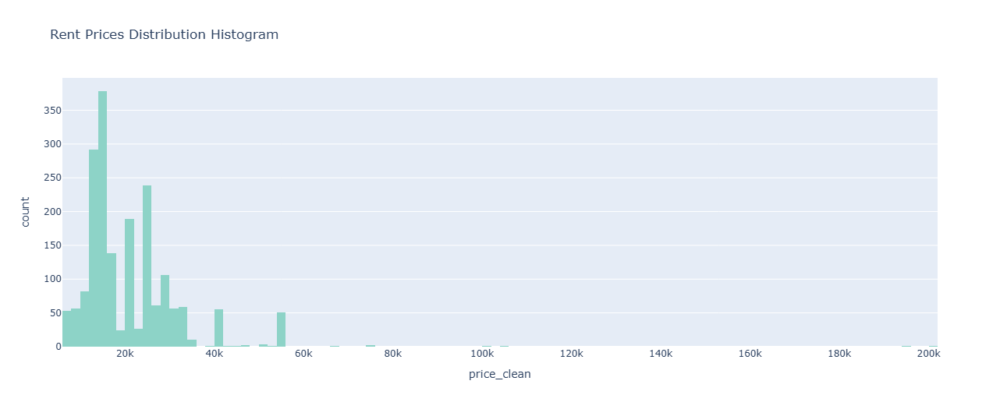
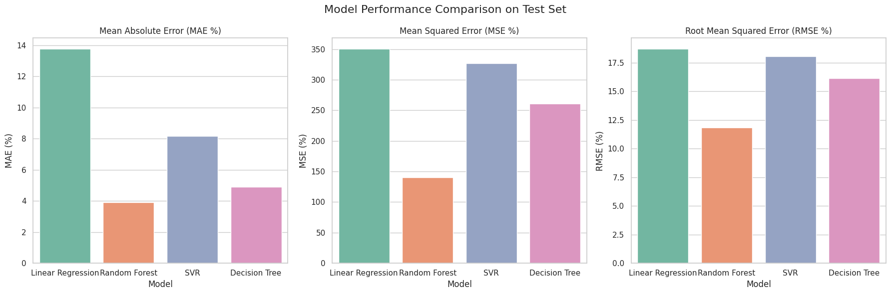

# 🏠 House Rental Price Prediction

## 📌 Project Summary

**Objective**: Predict rental apartment prices in **Bursa, Turkey** using real estate data scraped from major Turkish property websites.  
**Approach**: A full ML pipeline from **data scraping** to **model deployment-ready evaluation**, supported by rich EDA and performance visualizations.

---

## 🎯 Project Goals

- Scrape real estate listings from Turkish property websites
- Clean and preprocess the data
- Conduct exploratory data analysis (EDA)
- Train and evaluate multiple machine learning regression models
- Identify key features that impact rental prices
- Provide a tool to estimate prices based on apartment features

---

## 🛠️ Tools & Technologies

- **Languages**: Python
- **Libraries**: pandas, numpy, matplotlib, seaborn, plotly, scikit-learn
- **Web Scraping**: BeautifulSoup, Selenium
- **ML Algorithms**: Linear Regression, Decision Tree, Random Forest, SVR, Lasso

---

## 📥 Data Collection

The dataset was constructed by scraping listings from:

- 🏡 [HepsiEmlak](https://www.hepsiemlak.com/)
- 🏢 [Emlakjet](https://www.emlakjet.com/)
- 🏘 [Remax](https://www.remax.com.tr/)

### Main Features

- `price_clean`: Monthly rent (TL)
- `m2_net_clean`: Net usable area
- `oda_clean`: Number of rooms
- `banyo_sayisi_clean`: Number of bathrooms
- `kat_sayisi_clean`: Total floors
- `bulundugu_kat_clean`: Apartment’s floor
- `bina_yasi_clean`: Age of the building
- `Isıtma Türü`: Heating type
- `İlçe`: District
- `eşyalı`: Furnished (Yes/No)
- `site içinde`: Inside site (Yes/No)

---

## 🧪 Experiments Conducted

### 1. Data Preprocessing
- Missing value handling (mean imputation)
- Feature transformation & one-hot encoding
- Outlier filtering using the IQR method
- Type conversion for numerical features

### 2. Exploratory Data Analysis (EDA)
- Visual distribution of prices, room counts, bathroom counts, and floor levels
- Pairplots and correlation heatmaps
- Boxenplots to analyze room count vs. price
- Pie charts for categorical feature visualization
- Random Forest feature importance analysis

### 3. Model Training & Evaluation
- Train/test split: 70/30 and 80/20 variations
- Feature scaling using `StandardScaler`
- Regression models implemented:
  - Linear Regression
  - Decision Tree Regressor
  - Support Vector Regressor (SVR)
  - Random Forest Regressor
  - Lasso Regression
- Evaluation metrics:
  - MAE, MSE, RMSE
  - R² Score

### 4. Single Prediction & User Simulation
- Each model tested on unseen test data
- Prediction error (%) calculated
- Simulated predictions for a custom apartment

---

## 📈 Key Results

- **Random Forest** had the best performance across all error metrics.
- Most impactful features: **Net Area**, **Floor Level**, and **Total Number of Floors**.
- Visualizations helped reveal hidden patterns and feature relationships.
  
---

## 📷 Visual Insights

This project is heavily supported with visuals:

- Floor & bathroom distributions  
- Room count vs. price boxenplots  
- Correlation heatmaps  
- Actual vs. Predicted scatter plots  
- Feature importance charts  
- Model comparison graphs (MAE, MSE, RMSE)

---

## 🧹 Data Preprocessing Visuals

### 🔍 1. Rent Price Distribution (Before Cleaning)
Skewed due to extreme outliers.

---

### 📦 2. Boxplot of Raw Rent Prices

Outliers above 50,000 TL distort the distribution.

---

### 🧽 3. After Outlier Removal

Boxplot and histogram show a cleaner, more realistic distribution.

 

---
## 📊 Exploratory Data Analysis

### 🛋 4. Room Count vs. Price (Boxenplot)

Price generally increases with more rooms.

---

### 🔥 5. Feature Correlation

Heatmap of correlation between numerical features.

---

### 📊 6. Pairwise Scatter Plots

Relationship across key numerical features.

---

### 🚿 7. Bathroom Count Distribution

Most listings have 1 bathroom. Few have more.

---

### 🏢 8. Floor Number Distribution

Most listings are between 3–6 floors.

 

---

## 🤖 Machine Learning Models

We applied the following regression models:

| Model               | Preprocessing | Scaled | Notes                    |
|---------------------|---------------|--------|---------------------------|
| Linear Regression   | Yes           | Yes    | Baseline model            |
| Decision Tree       | Yes           | No     | Handles non-linear data   |
| Random Forest       | Yes           | No     | Best performing model     |
| SVR                 | Yes           | Yes    | Kernel-based approach     |
| Lasso Regression    | Yes           | Yes    | For feature selection     |

---

### 🎯 Actual vs Predicted Prices (Best Model)

---

### 🌟 Feature Importance (Random Forest)

Net usable area and floor level have the most influence on rental prices.

---

### 📉 Model Comparison (MAE / MSE / RMSE)

Random Forest consistently outperformed others.

---

## 📌 Key Takeaways

- **Random Forest** gave the lowest prediction error across all metrics.
- **Net area**, **floor level**, and **number of rooms** are most impactful features.
- Removing outliers greatly improved model reliability.
- Visualizations enabled clearer understanding of complex relationships.

---

## 💡 What We Learned

- **Web scraping real-world data** can be messy but powerful when done correctly.
- **Outlier removal** dramatically improved the model's predictive power.
- **Tree-based models**, especially Random Forest, handle this regression task best.
- **EDA and visualization** guided our feature selection and model tuning effectively.

---

## 📈 Future Improvements

- Extend scraping to other cities
- Integrate **time-based price trends**
- Add **location-based attributes** (distance to metro, university, etc.)
- Deploy as a **web app** for end users

---

